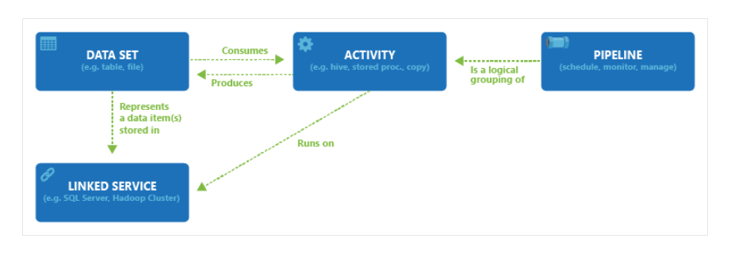

# Azure Notes

## ADF

### Relationship between ADF components

### Concurrency of pipeline

pipeline concurrency: multiple instances of the pipeline running concurrently

lets say you are calling a pipeline inside a forEach activity. So that pipeline is a child pipeline. Now this child
pipeline will have multiple instances based on the no. of elements in the for each. If you want to be able to run all of
the instances of the child pipeline parallely then you increase the concurrency to no. of instances. Otherwise if the
concurrency is one the child pipelines will run one after the other, at any given time there will only be one instance
of the child pipeline in the ADF
instance. [example](https://stackoverflow.com/questions/60531480/increasing-concurrency-in-azure-data-factory)

