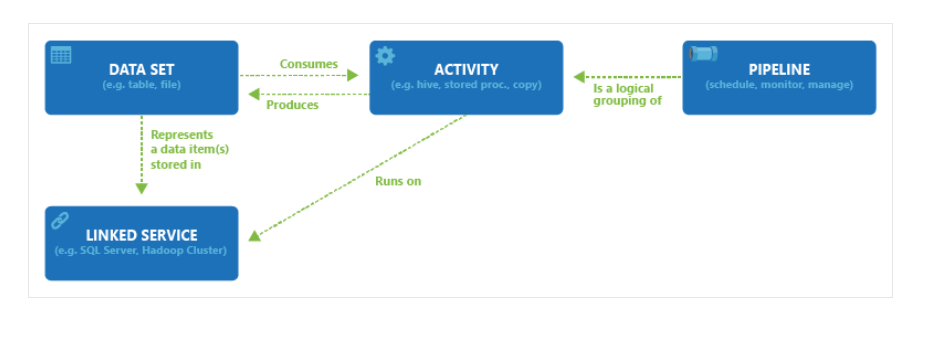

# Azure Notes

## ADF

### Relationship between ADF components

### Concurrency of pipeline

pipeline concurrency: multiple instances of the pipeline running concurrently

lets say you are calling a pipeline inside a forEach activity. So that pipeline is a child pipeline. Now this child
pipeline will have multiple instances based on the no. of elements in the for each. If you want to be able to run all of
the instances of the child pipeline parallely then you increase the concurrency to no. of instances. Otherwise if the
concurrency is one the child pipelines will run one after the other, at any given time there will only be one instance
of the child pipeline in the ADF
instance. [example](https://stackoverflow.com/questions/60531480/increasing-concurrency-in-azure-data-factory)

In case of Tumbling windo trigger too a similar concept is used, tumbling window can be used to backfill data
processing. So in such cases we can have multiple instances of the pipeline(being triggered by the tumbling window
trigger)

## Storage Accounts

### Authentication

### Shared Access Signature (SAS Token)

An account key gives the the user possessing the key the entire access to the data in the storage account

SAS allows granular control on how someone can access the data.
* What resources the client may access.
* What permissions they have to those resources.
* How long the SAS is valid.

