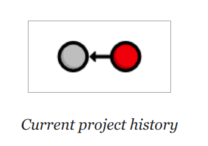
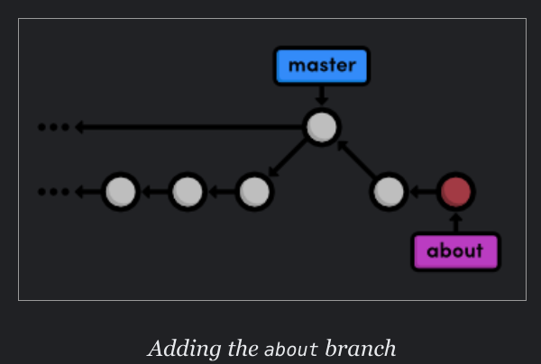

# Git Notes

## Pushed .idea directory into remote respository from pycharm

To remove the .idea directory from the remote repository, you can use the git rm command with the --cached flag to
remove it from the repository but keep it in your local working directory:

```bash
git rm --cached .idea
```

Then, commit the change and push it to the remote repository:

```bash
git commit -m "Removed .idea directory"
git push
```

To prevent the .idea directory from being pushed again in the future, you can add it to your .gitignore file. 

## Understanding conflicts
Initial Branches: You have two branches, "main" and "branch-A."

Committing Changes in Main Branch: Developers have been working on the "main" branch and have made some commits, including a change to a specific piece of code, let's call it "X," which resulted in "X" becoming "Z."

Committing Changes in Branch A: Meanwhile, developers have also been working on "branch-A" and have made some commits, including a change that intended to modify "X" to "Y."

Merge Attempt: When you attempt to merge "branch-A" into "main," Git considers the chronological order of commits. Since the changes in "branch-A" occurred after the latest commit in "main," Git recognizes "branch-A" as having the more recent changes.

Conflict Detection: During the merge process, Git identifies that "branch-A" is trying to change "X" to "Y," but when comparing with the current state of "main," "X" has already been changed to "Z" by some other commit on the "main" branch.

Conflict Resolution: The conflict arises because Git cannot automatically determine which change should take precedence (i.e., "X" to "Y" or "X" to "Z").

Manual Conflict Resolution: As a result, Git halts the merge process and asks you to resolve the conflict manually. You must decide whether to keep "X" as "Z" or accept the change to "Y" from "branch-A," or possibly make a different modification.

Committing Resolved Changes: After manually resolving the conflict by choosing the desired change, you commit the changes to complete the merge.

Merge Completion: The merge is now complete, and the changes from "branch-A" have been successfully integrated into the "main" branch, along with the conflict resolution you performed.

In summary, the conflict occurred because "branch-A" attempted to change "X" to "Y," but "X" had already been changed to "Z" in the "main" branch by another commit. Manual conflict resolution allows you to decide how to handle these conflicting changes and ensure that the final merged state of the code is coherent and reflects the intended modifications from both branches.

## Introduction
VCS --> DVCS

Stage a snapshot

git add
bring an untracked file under version control
Adds the file/files to the snapshot for the next commit

git add orange.html blue.html
git add . 
add all untracked files in the current directory to the next commit 

What is a snapshot? 
A snapshot represents the state of your project at a given point in time.

creating a snapshot = staging or you can say staging a snapshot
We can add or remove multiple files to a snapshot before commiting it

**We can group relevant changes into distinct snapshots for meaningful progression of software instead of arbitary lines of code**

**Saving a version of your project** is a two step process:
1. Staging a snapshot:  Telling Git what files to include in the next commit.
2. Commiting a snapshot:  Recording the staged snapshot with a descriptive message.

Commiting a snapshot will record it into the repositoy

`git log`: view project history; show commited changes\
`git status`: show staged changes


`git config --global user.name "Your Name"`

`git config --global user.email your.email@example.com`




Each circle represents a commit, the red circle designates the commit
we’re currently viewing, and the arrow points to the preceding commit.
This last part may seem counterintuitive, but it reflects the underlying
relationship between commits (that is, a **new commit refers to its parent
commit**).

if output of git log is too long press space to go to end and then press q to return to command line

`git log --oneline`

`git log --oneline blue.html`

**Adding files to the staging area, editing the files, once you are done with editing you have a staged snapshot,
commit the snapshot**


## Undoing changes

View an older version:\
`get checkout <commit-hash>`

"You are in 'detached HEAD' state. You can look around, make experimental
changes and commit them, and you can discard any commits you make in this
state without impacting any branches by switching back to a branch.

If you want to create a new branch to retain commits you create, you may
do so (now or later) by using -c with the switch command. Example:

  `git switch -c <new-branch-name>`

Or undo this operation with:

`git switch - "`

Return to current version:\
`git checkout master`

Never make any changes in the detached head state as all your changes will be lost. You need to be on a branch to make
changes

This makes Git update our working directory to reflect the state of the
master branch’s snapshot.

All of our actions in The Basics took place on the
master branch, which is where our second and third commits still
reside. To retrieve our complete history, we just have to check out this
branch.

`git tag -a v1.0 -m "Stable version of the website"`

`git tag`

#### Undoing commited changes:

`git revert <commit-hash>`
This will not delete the commit, git will figure out how to undo the changes it contains and creates another commit
with the resulting content. **So this new commit and the commit before the commit that was reverted will represent the
exact same snapshot.** **So git doesn't lose history even for reverted commits**, the reverted commit is still accessible.


#### Undoing uncommited changes:
For tracked files:\
`git reset --hard`\
This changes all tracked files to match the most recent commit. Note that the --hard flag is what actually updates the
file.**Running git reset without any flags will simply unstage the files, leaving its contents as is**. git
reset only operates on the working directory and the staging area, so
our git log history remains unchanged.

For Untracked files:
`git clean -f`

`git reset` and `git clean`. Both operate on the working directory, not  on the committed snapshots. Unlike `git revert`,
they
permanently undo changes, so make sure you really
want to trash what you’re working on before you use them.

 most Git commands operate on one of the
three main components of a Git repository: the **working directory**, **the staged
snapshot**, or the **committed snapshots**. The `git reset` command undoes
changes to the working directory and the staged snapshot, while `git
revert` undoes changes contained in committed snapshots. Not
surprisingly, `git status` and `git log` directly
parallel this behavior.


## Banches

`git branch`: show all branches


 The
master branch is Git’s default branch, and the asterisk next
to it tells us that it’s currently checked out. This means that the most
recent snapshot in the master branch resides in the working
directory. 

`git checkout <commit-hash>`

This command returns a message that says we’re in a detached
HEAD state and that the HEAD is now at
<commit-hash>. **The HEAD is Git’s internal way of
indicating the snapshot that is currently checked out**. This means the red
circle in each of our history diagrams actually represents Git’s
HEAD. The following figure shows the state of our repository
before and after we checked out an old commit.


As shown in the “before” diagram, the HEAD normally
resides on the tip of a development branch. But when we checked out the
previous commit, the HEAD moved to the middle of the branch. **We
can no longer say we’re on the master branch since it
contains more recent snapshots than the HEAD**. That's why we say that the HEAD is detached

We can't add new commits when we are in the detached HEAD state because we are not on any branch. So we create a branch
when we are in the detached HEAD state. This creates a branch which has the same snapshot as the commit.

`git branch crazy`\
`git checkout crazy`

Right now, the crazy branch, HEAD, and working
directory are the exact same as the fourth commit.  But as soon as we add(commit)
another snapshot, we’ll see a fork in our project history


]

Add a new file and do
`git commit`


as wee can see `git log` only shows the history of the current branch


Note that the history before the fork is considered part of the new
branch


#### Renaming a file
`git status`\
`git rm crazy.html`\
`git status`\
`git add rainbow.html`\
`git status`


`git checkout master`\
 These two branches became completely independent
development environments after they forked. You can think of them as separate
project folders that you switch between with git checkout. They
do, however, share their first four commits.


#### more on branching
creating the css branch\
`git branch css`\
`git checkout css`


After two commits to css branch


`git checkout master` Returning to the master branch


`git merge css` merging the css branch into master

Instead of re-creating the commits in css and adding them to
the history of master, Git reuses the existing snapshots and
simply moves the tip of master to match the tip of
css. **This kind of merge is called a fast-forward
merge.** 

**As you can see in fast forwarding no extra commit is done**


`git branch -d` css deleting the css branch


`git checkout crazy`

`git merge master`


**As we can see, this merge will add an extra commit to the history of the branch whereas in earlier merge(fastforward)
that wasn't the case.**


it has two parent commits.
The above figure visualizes this with two arrows originating from the tip of
crazy.  It’s like saying “this commit comes from both
the crazy branch and from master.”

**After the merge, the crazy branch has access to both its history
and the master history.**


`git commit -a -m "Add CSS stylesheet to rainbow.html"`

Notice that we skipped the staging step this time around. Instead of using
git add, we passed the -a flag to git
commit. This convenient parameter tells Git to automatically include
all tracked files in the staged snapshot.


`git branch crazy-alt`\
`git checkout crazy-alt`


`git commit -a -m "Make a REAL rainbow"`


`git checkout master`\
`git branch news-hotfix`\
`git checkout news-hotfix`\
`git commit -m "Add 1st news item"`


`git checkout master`\
`git merge news-hotfix`\
`git branch -d news-hotfix`


This is our first merge conflict. Conflicts occur when we
try to merge branches that have edited the same content. Git doesn’t know
how to combine the two changes, so it stops to ask us what to do.

`git status`


We’re looking at the **staged snapshot of a merge commit**. We never saw
this with the first 3-way merge because we didn’t have any conflicts to
resolve. But now, Git stopped to let us modify files and resolve the conflict
before committing the snapshot. The “Unmerged paths” section
contains files that have a conflict.

### Rebasing

Git includes a tool to help us clean up our commits: `git
rebase`. Rebasing lets us move branches around by changing the commit
that they are based on.


After rebasing, the feature branch has a new parent commit,
which is the same commit pointed to by master. **Instead of joining
the branches with a merge commit, rebasing integrates the feature
branch by building on top of master.**

The result is a perfectly linear history that reads more like a story than the hodgepodge of
unrelated edits shown above.


`git branch about`\
`git checkout about`\
`git add about`\
`git commit -m "Add empty page in about section"`\
`git commit -a -m "Add contents to about page"`



hotfix!

`git checkout master`\
`git branch news-hotfix`\
`git checkout news-hotfix`\
`git commit -a -m "Add 2nd news item to index page"`\
`git checkout master`\
`git merge news-hotfix`\
`git branch -d news-hotfix`

The master branch hasn’t been altered since we created
news-hotfix, so Git can perform a fast-forward merge.

`

 We want to pull changes from master into a feature branch,
only this time we’ll do it with a **rebase** instead of a merge.

`git checkout about`\
`git rebase master`\
`git log --oneline`


Originally, the about branch was based on the Merge
branch 'crazy-experiment' commit. The rebase took the entire
about branch and plopped it onto the tip of the
master branch.  like the git merge command, **`git rebase`
requires you to be on the branch that you want to move**.


After the rebase, about is a linear extension of the
master branch, **enabling us to do a fast-forward merge later on**.
Rebasing also allowed us to integrate the most up-to-date version of
master **without a merge commit**.

git add about/me.html
git commit -m "Add HTML page for personal bio"


Remember that thanks to the rebase, about rests on top of
master. So, **all of our about section commits are grouped together**,
which would not be the case had we merged instead of rebased. This also
eliminates an unnecessary fork in our project history.

`git commit -m "Add empty HTML page for Mary's bio"`

`git commit -a -m "Add link to about section in home page"`


Before we merge into the master branch, we should make sure we
have a clean, meaningful history in our feature branch. By rebasing
interactively, we can choose how each commit is transferred to the new
base.

Leaving it as is will do a normal git rebase, but if we move the
lines around, we can change the order in which commits are applied.

`git rebase -i master` 


#### Stop to amend a commit

`git rebase -i master`


When Git starts to move the second commit to the new base, it will stop to
do some “amending.” This gives you the opportunity to alter the
staged snapshot before committing it.

`git add about/mary.html`\
`git status`\
`git commit --amend`

 The new
‑‑amend flag tells Git to replace the existing commit
with the staged snapshot instead of creating a new one. This is also very
useful for fixing premature commits that often occur during normal
development.

Remember that we’re in the middle of a rebase, and Git still has one
more commit that it needs to re-apply. Tell Git that we’re ready to move
on with the --continue flag:

`git rebase --continue`\
`git log --oneline`


Note that our history still appears to be the same (because we used the
default commit message above), but the Begin creating bio pages
commit contains different content than it did before the rebase, along with a
new ID.

If you ever find yourself lost in the middle of a rebase and you’re
afraid to continue, you can use the `‑‑abort` flag to
abandon it and start over from scratch.

`git checkout master`\
`git log --oneline`\

`git merge about`\
`git log --oneline`\


`git branch -d about`
`git log --oneline`\


Rebasing enables fast-forward merges by moving a branch to the tip of
another branch. It effectively eliminates the need for merge commits, resulting
in a completely linear history.

you can use the following command to force a
merge commit when Git would normally do a fast-forward merge.

`git merge --no-ff <branch-name>`


CHANGES GET STAGED INTO A SNAPSHOT. First you change files. After you are done changing files
you stagq the changes into a
snapshot using the `git add` command. After you are done staging the snapshot you commit the snapshot


## Quick ref

`git init`
Create a Git repository in the current folder.

`git status`
View the status of each file in a repository.

`git add <file>`
Stage a file for the next commit.

`git commit`
Commit the staged files with a descriptive message.

`git log`
View a repository’s commit history.

`git config --global user.name "<name>"`:
Define the author name to be used in all repositories.

`git config --global user.email <email>`:
Define the author email to be used in all repositories.

`git checkout <commit-id>`
View a previous commit.

`git tag -a <tag-name> -m "<description>"`
Create an annotated tag pointing to the most recent commit.

`git revert <commit-id>`
Undo the specified commit by applying a new commit.

`git reset --hard`
Reset tracked files to match the most recent commit.

`git clean -f`
Remove untracked files.

`git reset --hard /  git clean -f`
Permanently undo uncommitted changes.

`git branch`
List all branches.

`git branch <branch-name>`
Create a new branch using the current working directory as its
base.

`git checkout <branch-name>`
Make the working directory and the HEAD match the specified
branch.

`git merge <branch-name>`
Merge a branch into the checked-out branch.

`git branch -d <branch-name>`
Delete a branch.

`git rm <file>`
Remove a file from the working directory (if applicable) and stop
tracking the file.

`git commit -a -m "<message>"`


