# Spark notes

## Concepts

### OOMING

When multiple tasks are running on the same executor(becasue the executor has multiple cores). You can get OOM because
even though the tasks are running on different cores they are still using the same executor memory. So if your executor
has 3 cores, running 3 tasks, on 3 different partitions you can get OOM error if the sum of the memory consumed by the 3
partitions is greater than the total available memory in the executor.

### Small file problem

In case of a spark code that reads data from a dfs, performs a transformation, and writes the data back to dfs

If each task writes its output data to the file system separately, it may lead to a large number of small files being
written to the file system, which can degrade the write performance and increase the overhead of the file system. To
avoid this, it's better to batch the output data of multiple tasks and write them to the file system in a single
operation, reducing the number of small files and improving the write performance.

In Spark, you can control the batch size by adjusting the spark.sql.shuffle.partitions configuration parameter, which
determines the number of partitions used in shuffling the data between stages. By setting this parameter to an
appropriate value, you can balance the memory usage and the write performance, and optimize the output write operations
for your specific use case.

### Does a task operate on a partiiton as a whole or an element of a partition?

In Spark, a task operates on a partition as a whole, rather than on an element of a partition.

A partition is a logical division of the input data, which is processed independently by a single task. The data in a
partition is typically stored as an RDD (Resilient Distributed Dataset), which is a fault-tolerant collection of
elements that can be processed in parallel across multiple nodes in a cluster.

When a task is assigned to a partition, it operates on the entire partition as a whole, rather than on individual
elements of the partition. The task processes the data in the partition and produces an output, which is typically
another RDD or a result that is written to a file system.

The partitioning of the data and the assignment of tasks to partitions is done automatically by Spark, based on the
partitioning strategy used for the RDDs.

### spark.sql.shuffle.partitions

### What is AQE

https://www.intel.com/content/www/us/en/developer/articles/technical/spark-sql-adaptive-execution-at-100-tb.html

### Distributed shared memory vs RDDs

**fine grained updates to mutable states vs coarse grained transformations on immutable objects**

**logging the data vs logging transformations**

In-memory storage across clusters: You have a huge file and you want to process it in memory since operating on objects
that are in memory is way faster than first loading them into disk and then operating on them. But the problem is that
the file will not fit in memory of a single machine. One way to do this would be load chunks of the file into memory
and process the whole file chunk by chunk in a single machine. But this will be slow, another alternative would be to
have a cluster of machines and laod a partiion of the large file into each of the machines. Now each machine can
process their own partition parallely. Thus we can say that we **put the data where the compute is**.

Existing solutions for In-memory storage across clusters: Distributed shared memory

DSM systems allow fine grained updates i.e. you can update each cell of each row of your file in memory. That sounds
great
but the problem occurs when you have to implement **fault tolerance** i.e when a machine in your cluster containing a
partition of
your large file breaks down. Now to make that available you have to log each update and keep replicating your data to
another machine continuously
so that if a machine is lost you can have another machine which contains the lost data using the logs (Replication log).
But there are problems. When you use replication it means you have to copy a large amount of data across the network
to another machine.
Networks bandwidths between machines in a cluster are not that great. Also storing logs of every update can increase the
storage costs.

This is where coarse grained transforamtion comes in. RDDs don't allow you to make fine grained updates to your partiion
of data,
instead can only perform transformations that apply to the entire data and thus all elements of a partition. So you
cannot
update individual rows/cells of your data, you have to transform your entire data(and create new data). So when a
machine breaks down and
a partition is lost, the only thing you need to recalculate the partiion is the log of transofrmations(which will be
tiny). You can use this
log to recalculate your lost partition right from source. So as you can see we have eleminated both the **network
bandwidth issue** and the **log storage costs** by using
RDDs.

We have eleminated the need for any **large scale, data intensive** communcation between the machines over the **network
**

But that's not the whole picture, RDDs are only capable of solving usecases where you don't need fine grained updates to
shared state. SO it is also said
that **"RDDs are a restricted form of shared memory"**. Nevertheless, there are a lot of usecases, especially in
analytics where we need
coarse grained transformations instead of fine grained updates.

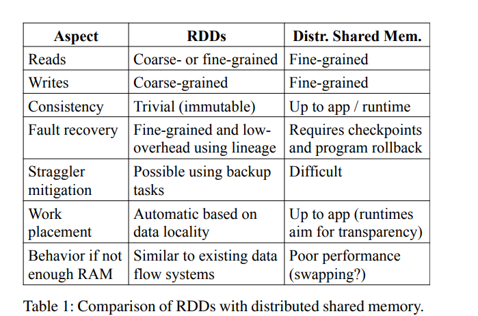

### Representing an RDD

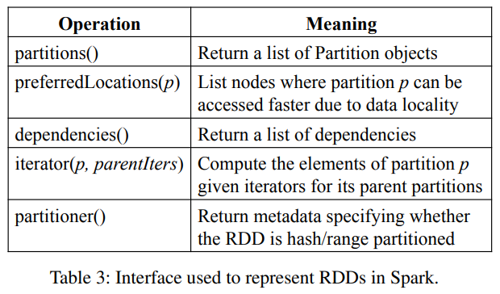

### Spark internals

Networking: Cache data and replicate it across machines

Block manager: key value store that acts as a cache

#### Components

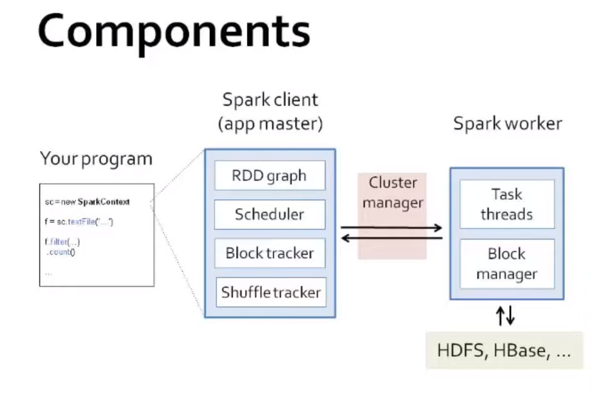

In your program you create this object called spark context and then you create these distributed datasets called RDDs
and you apply different operations on them.

Spark client(app master) : Spark context acts as a client for spark and it also acts as a master for your application.
In spark we have one master per job/application so that thing connects to the cluster and schedules things and if it
crashes only your job is lost
and other people's jobs running on the cluster remain unaffected when your master crashes. We don't have a single master
that knows about every application.

Block tracker : Figures out what is in memory on each machine

Shuffle tracker: Coordinates shuffle operations like group by

Cluster manager: Scheduler talks to a cluster manager through a worker

Spark worker: Worker is very simple .All it does is it receives tasks that it runs inside a threadpool and then it has
this key value store, the block manager and it can serve blocks to other nodes. The tasks themselves can talk to hdfs
and
stuff like that.

There will be multiple workers and the workers can talk to each other through the block manager to fetch blocks from
each other

#### Example Job

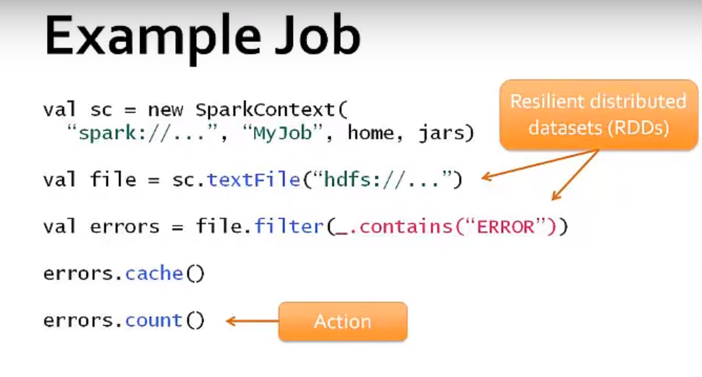

you first create a spark conbtext object you tell it to connect to a cluster. You create these distributed datasets
called rdds. These are the objects that you work with.

Nothing actually gets computed until you run this thing called action. So action is a method that instead of returning
an RDD it returns an integer or something so we actually have to go out and compute soemthing.
At this point, when you call count the system is gonna look at all the transformations you did and say okay, how am I
going to turn these into a bunch of tasks and actually run them

#### RDD graph

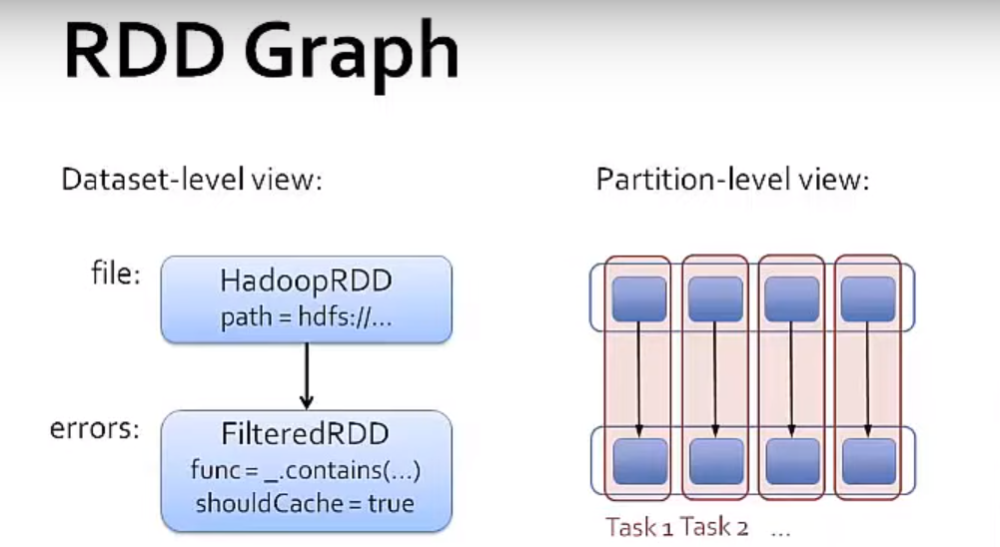

Each time you call filter and group by and all these transformations, you are building this graph of objects that
depend on each other, eg. here we have file and errors. And each of these objects is a subclass of RDDs.

HadoopRDD: Its an RDD that knows its path in HDFS

FilteredRDD: Remembers the filter function you gave it and also knows it's parent. So it has this pointer to its parent

Finally each RDD remembers wether it should be stored in memory(cached) or otherwise.

Even though the graph is built in the context of datasets(RDDs) when we actually run stuff we run it in terms of
partitions. So each dataset is composed of multiple partitions(think of it as blocks in your file) and each partition
can be sitting on a different machine. Some partiions can be on two machines, if it's a replicated dataset.

The system inside knows the dependencies at the level of partitions. In case of Filter for eg. lets say the 4 things
on the top correspond to blocks of the hdfs file. For each of those 4 things I did a filter to get the corresponding
partition.

Finally, Given these graphs of partiions that depend on each other the system has to decide to launch some tasks. And
it's not just gonna launch some tasks to do each of these operations things and have the tasks exchange data from one
operation to the other. The system actually tries to pipeline together as many operations as it can. So in this case it
says, Okay you have this file you need to read form hadoop, then you need to do a filter and at then end you are doing
a count, so I am gonna launch **one task** that is going to read block1, filter block1, return the count to the master.
I am gonna launch another task that is going to do the same for block2 and so on. So lets say you a map operation after
the filter in the same example you would still have only 4 tasks.

#### Data locality

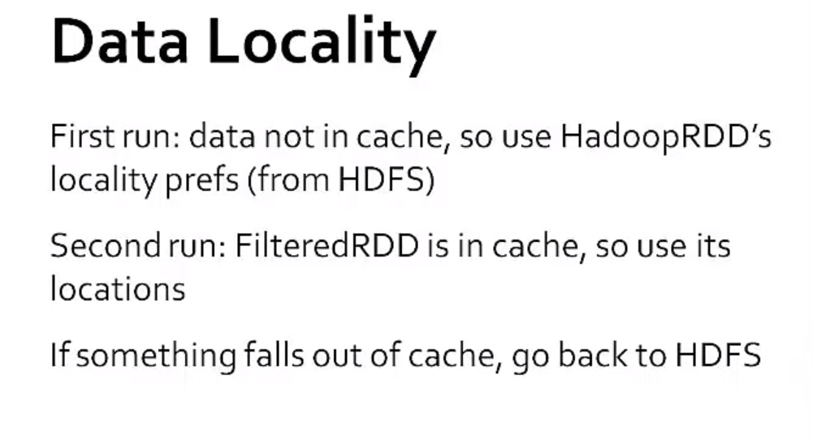

When spark does this scheduling it also knows about the **data locality** **and** about **data that's already cached**.
Data locality is a hint in spark. Any task can run on any machine but when possible spark tries to assign tasks based
on locality. So in the example of our current program, when it's running for the first time spark would say , I haven't
actually cached the file yet so let me look at the locality preferences of hdfs and launch the tasks based on that.
So the best place to run the tasks during the first run would be the machines where the hdfs blocks are located or
loaded into.
Each task that processes an hdfs block will run on the machine where the hdfs block is located.

The second time you run it, it's actually gonna look at graph and say these error partiions are sitting in the cache
somewhere so I am just going to reuse those and it's going to use those locations for the task.

And because we remember this whole graph of operations, we can always go back to sending the task to the machine where
the hdfs block is instead of the machine where the filtered block was supposed to be cached but isn't

#### Life of a Job

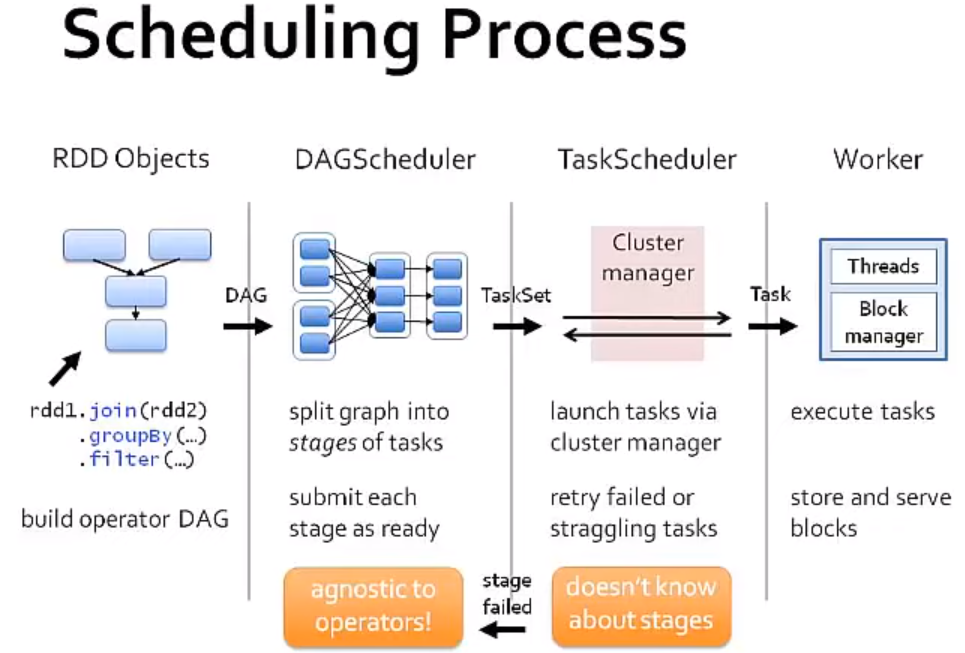

first stage: RDD objects:
In your code you are building up this graph of operators and datasets

**DAGScheduler**
These graphs are just sitting there. When you call an action on it like count() it gets submitted to a DAGScheduler.
So the DAGScheduler is the top half of the scheduler in Spark. It is the higher level scheduler. So the DAG scheduler
builds up this graph at a partition level that we saw earlier where it knows the dependencies at the partition
level and it has 2 roles

Look at this graph and do the pipelining required and turn the partiions into tasks.

The tasks will be grouped into stages and between the stages there will be some barriers. In the above DAG before the
grouped id we have to first finish all the map tasks before we can start teh reduce tasks. So basically the DAGScheduler
is going to divide this graph into stages and then it's going to submit each stage to run on the cluster as previous
parent stages finish.

(In the DAG after the partiions in the grouppby result is 3, so level of parallelism is 3. It is decided by the user
while writing the code itself, it doesn't change at runtime*)

the DAGScheduler doesnt know anything about the operators it's running. So it doesn't need to be changed each time you
add a new operator

**TaskScheduler**
At the top level we split the graph into stages and inside each stage we have these independent tasks. Within a stage
the number of tasks is basically the degree of parallelism.

The job of the TaskScheduler is, given one of these set of tasks called TaskSet, actually run it on a cluster. So it
has a simple role, it doesn't care about what the stage depends on before or what comes after, its job is to just get
these tasks done and tell the DAGScheduler when it's finished so it can submit the next stage.

So a TaskSet corresponds to all the tasks to be completed for a stage to finish. When a TaskScheduler is done with
a TaskSet we can sa that a stage is finished. Then the TaskScheduler informs the DAGScheduler that it has completed
that it has completed the stage and it can accept the next stage.

(A stage is basically a set of tasks TaskSet. So in our above DAG there will eb 3 stages; the first stage is going to
be the map task for the first RDD, second stage is going to be the map task for reading the second RDD. Both these
stages can run in parallel. The third stage is going to be the filter part which will run after the first two stages
are completed.

The boundary of a stage is usually wherever there is a shuffle because we need to finish all the map tasks before we
start the reduce tasks

So when you say submit each stage you mean submit each pipelined set of tasks(taskSet) as their parent becomes ready.
So in our example we will submit stage 1 and 2 at the same time and when they are both done we submit the third stage.
)
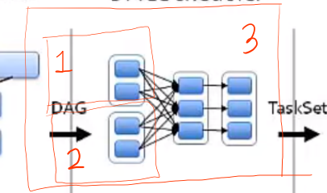

Essentially there are only two things a task can do

1. It's the final output of the job(like in stage 3) and you it will either save to hdfs or return it back to the master
   like in the case of a count.
2. It's like the map side of a shuffle. In this case it's going to write it to like local blocks in memory or on disc
   in the block store(we talked about earlier) and later other nodes(reducers) are going to fetch it from that machine.

So essentially within a stage there are only as many tasks as the degree of parallelism there are only as many tasks as
the number of partitions. This is because within a stage the operations are pipelined together. So those tasks can only
do the above two things. Nothing else. All the oeprations we write are pipelined within the task.

So a stage corresponds to only one task code. But multiple tasks are created, one per partiion for parallalism. These
tasks run independently of each other, that's how we get the parallelism.

So what is the task for the third stage? Read the map outputs from all the previous tasks, applying the filter, counting
and returning the count to the master? Is this the task for the third stage? The number of tasks launched will be the
number of partiions in the grouped output. Each task will go to map outputs from all the tasks in the previous stages,
fetc hthe relevant files, filter, count and return the count to the master

So its fair to say that shuffling happens in two stages. It's performed by two different tasks in two different stages.
It's just done in two parts bu two differnt stages.

The TaskScheduler doesn't know about the dependencies between stages. So all it does is, you give it a bunch of tasks
it runs them, The only way it kinda knows about stages is when a task fails because it couldn't fetch outputs from a
previous stage. That's a special kind of error where it tells the dagscheuler that thing.

The Task object itself encapsulates everything so the TaskScheduler doesn't know what's inside the task. So in stage 3
our task object calls both the groupby(fetch map outputs) and filter operations. We create a task object that performs
both these operations. The TskScheduler doesn't look inside.

The worker just gets teh Task object and calls run on it.

**Cluster manager**:
It's job is , you have a bag of tasks and you are trying to run them, it handles retrying each task a fixed number of
times. For eg. if one of the nodes fails or it's going slowly we might try running the task on a differnt node.

The thing is can't handle though is when you loase the output of a previous stage in the shuffle because then you are
going to launch the task and it tries to talk to that node and it fails. So that is the one case where you go back
to the dagscheduler and tell it that this previous stage is now failed, can you resubmit it? Otherwise fault handling
happens in the cluster manager itself

Here why did we say that the whole stage is failed because one task could not find one map output? Instead we just need
to resubmit only the task of which our task couldn't find the map output. If we can do this it would be actual good
fault tolerance.

How do we know if a task is straggling?
Heuristics. So if a task is taking longer than the median duration of all the other tasks in the same stage by a factor
of 1.5* then lets assume that it's straggling.

But this involves some assumptions. Eg. in the third stage reading the map outputs could be slower for some tasks
as they might need to read more data than the others due to some kind of skew. So we might end up launching more tasks
as a backup of these slow tasks which is not right. So we are assuming that the data does not have skew. Lets see if
this was fixed later. AQE?

Worker:
The task scheduler ends up sending tasks to the workers. And worker is a very simple thing, it has a bunch of threads
to run them and it has this block manger, it talks to the master and can serve blocks to other nodes. The worker knows
nothing about the task, it doesn't know about the stage, it just gets this piece of code and it's told by the master
"Run this and tell me if anything goes wrong or tell me what the result it gave at the end"

So lets say the worker operates on only one partiion(runs tasks on one partiion). It is told by the master to return
the count.

#### RDD Abstraction

How is DAGScheduler agnostic to the operators?

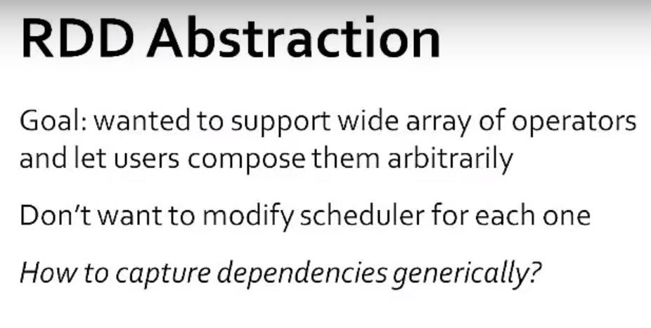

Capturing dependencies between datasets generically without having the scheduler know the details.

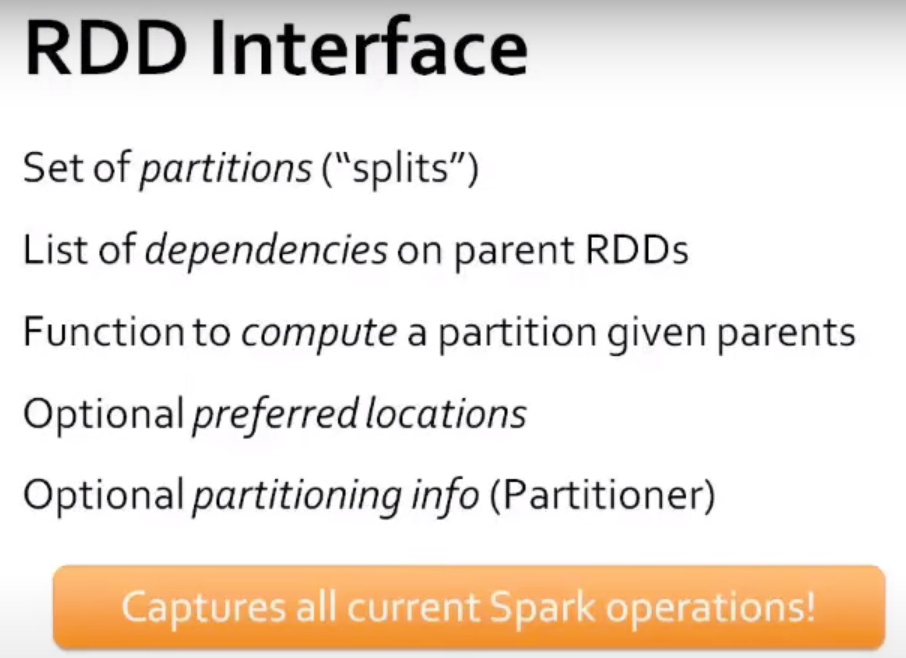

We have this RDD interface of RDD, it's based on 5 methods essentially. It captures all the information we need to know
about dependencies. All the spark RDDs are written by subclassing this interface.

When you define a new type of RDD. So this enables us to create new types of RDDs without making changes to the
scheduler. So if we want to create a new type of RDD we just have to define the below five methods properly. They
capture all the information we need to know about dependencies.

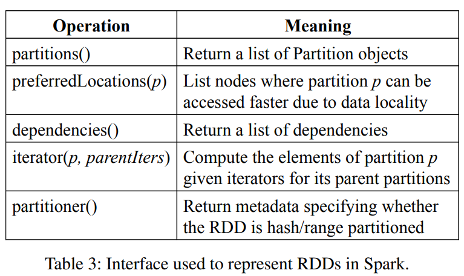

Set of partitions: eg. I have one partiion per hdfs blocks | Atomic pieces of a dataset

List of dependencies on parent RDDs | set of dependencies on parent RDDs

Function to compute a partition given it parents: given an iterator for each of the parents you should produce an
iterator for the output partition. | function for computing the dataset based on its parents

Optional preferred locations: locality preferences

Optional partitioning info(Partitioner): Captures the data distribution at the output (of the RDD). The scheduler can
use this to optimize future operations on this dataset

Examples

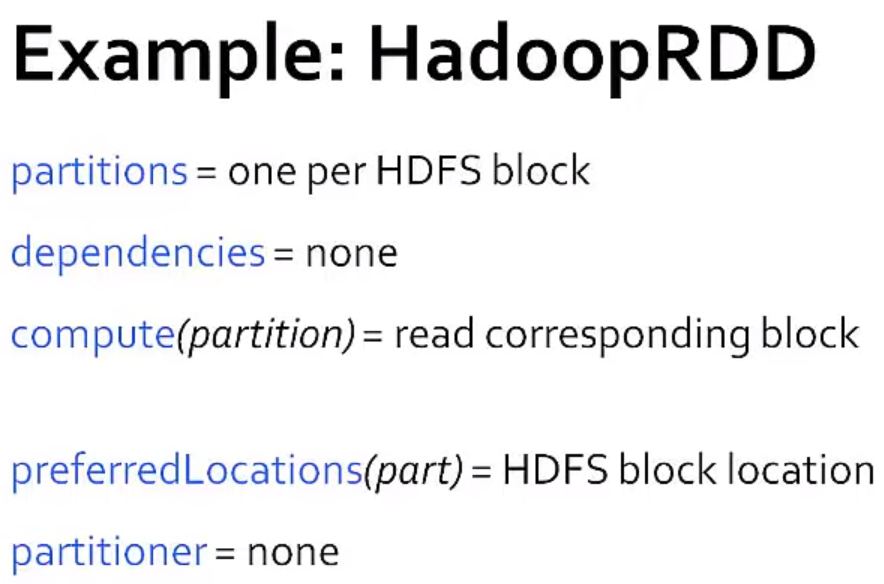

Simplest kind of RDD which is just inputs from an external system like hadoop. | has a partition for each block of the
file and knows which machine each block is on.

partiions method just returns one partition per block of the file. Maybe inside this partition object it has the block
id

the compute function is just to open up that block and read it, so just talk to hdfs and do this. Since it does not have
a parent Id it cannot use the
iterator of the parent to compute the child.

preferredLocations: To access each block we can ask HDFS which machines are there copies on and we wanna tell the
scheduler to use that. this is one of the things that the task scheduler and dagscheduler look at while launching the
task.

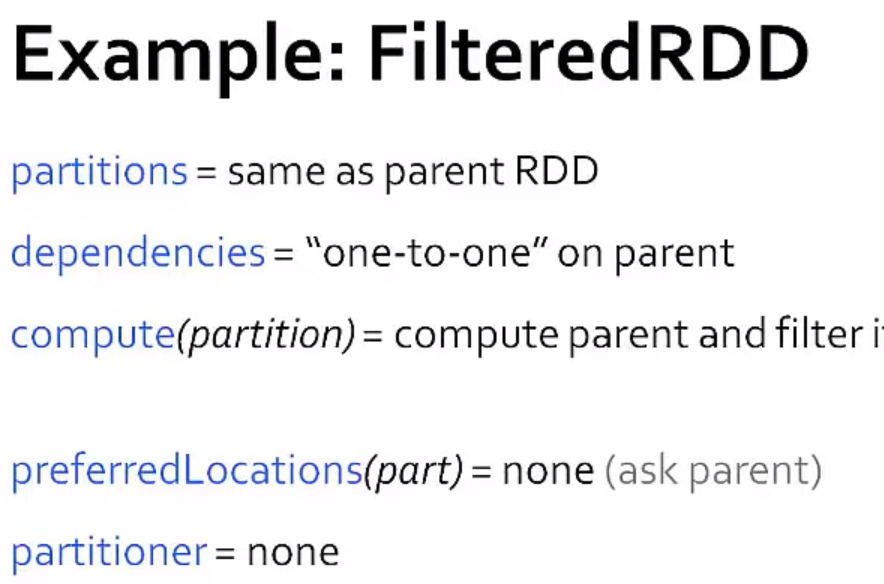

This rdd has a parent. We override the first three methods

This is the result of a filter on the earlier RDD and has the same partiions, but it applies the map function
to the parent's daa when computing its elements.

partitions are going to be same as parent, we are just going to filter each one in place

dependencies: each output partition depends on the corresponding input one.

compute(partition): you are given an iterator for the parent, look at the items in there and return only the ones
that pass the filter

preferredLocations: The scheduler will automatically look at the parent if an rdd partition doesn't have preferred
locations. If there's a shuffle then there are no preferred locations.

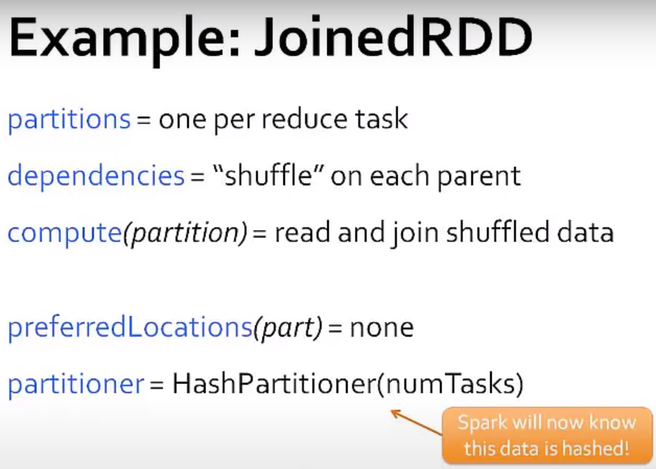

parttions: you set the number of reduce asks before so it's just one per task, and you configure it when you write your
spark program.

dependencies: we have a special type of dependency known as the shuffle dependency which tell the system to shuffle

compute(partiion) : Now you get iterators for the shuffled data. You just read the keys from each one and do a local
join for the things that were hashed to your partition.

preferredLocations: It has no placement permissions because you can place the reduce task anywhere, it has to use the
network to fetch the data anyway

partiions: we know that the output is going to be hash partitoned because we did a shuffle and that hashes the data.
it's nice because later on when we do other operations on this spark can sometimes avoid reshuffling the data because
it already knows that the data is shuffled.

#### Dependencies

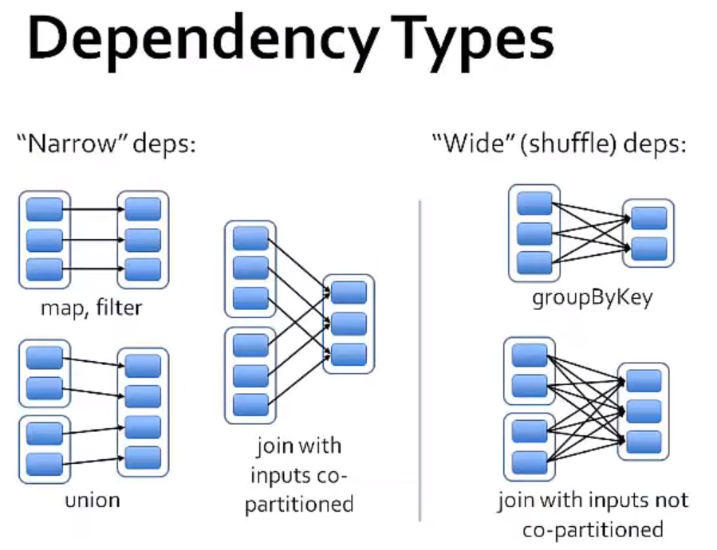

Narrow: One to one, essentialy things that can be pipelined. 

Wide: All to all, each output partiion depends on all of the input partiions. 

DAGScheduler:

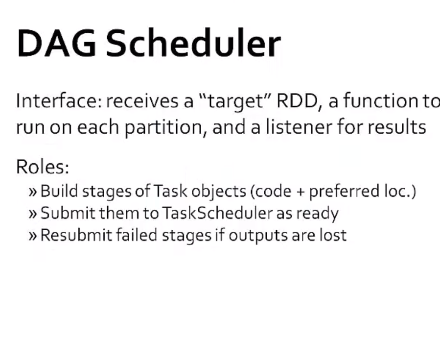

"The actual dasgscheduler object has this nice interface to the outside world that all the actions used to run and then
it looks at these dependencies and these objects that actually do stuff."

The interface to this is this method called run job and essentially you just give it an Rdd that you want to run the job
on, you give it a function to run on each partiion, you give it an object to listen for the results so each time a one
of the tasks completes and you get a result back the listener function is called.

Scheduler Optimizations:

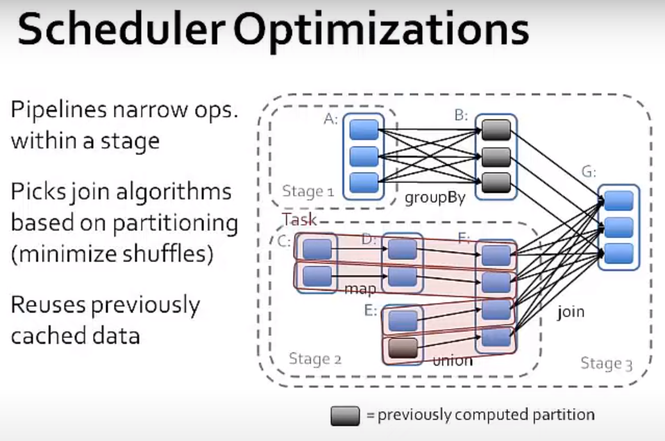

group narrow transformations into tasks.

We are joining one rdd that has 3 partitions and one rdd that has 4 partiions and we have decided that the output has
only 3 partiions so we dn't need to shuffle the rdd which has 3 partiions. So the output rdd has a narrow dependency on the 
rdd with 3 partiions and a wide dependency on the rdd with 4 partiions. Also since the rdd3 is cached in memory the
scheduler will place those tasks on the machines where it is cached.

Workers are long running JVMs shared across tasks

How the scheduler knows previously cached data?
As the workers complete stuff, if the dataset was marked to be cached they will tell the master, they'll say now I have 
partiion 5 of this dataset in memory. So each time when the master schedules a job it look at that and asks which ones
are already available. And how does it know that the partiions are still available after some time? The workers tell
the master when they drop the partiion from memory. 

The placements are only a hint, the task objects are designed to run on any node, if you put them on a node where the
data is cached they will read it from the cache, otherwise they will go back and recompute it or whatever it takes to
get that back. So it's okay that we hear that the partiion was dropped from memory on a machine after we sent a task
to that machine.

How is the life cycle of the cache data related to the lifecycle of the task?
The cached data stays cached until enough other cached data is created that it is evicted using the LRU policy on the
node. So the task can exit but the data will still be cached. The workers are persistent, all the tasks run in the same
jvm on each machine and that jvm stays around between tasks. The cached data is just sitting in the worker's memory.

Task details:

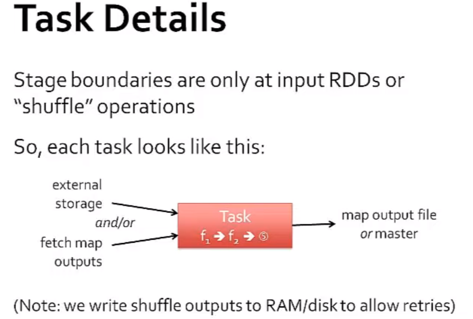

The way tasks begin is only at shuffle boundaries or external storage. When task runs, it runs multiple functions
that are chained together into these iterators. There can be 2 kind of outputs. One is a result that it sends to the
master eg. in count we send back an integer or it can create an output file that will be fetched in a later stage.

So from the pov of the worker running these tasks that's all that happens, it just gets this thing and runs it and sees
what happens.

We save the map output instead of piping them directly to the next stage. Reasons are simplicity and to allow you to
retry reduce tasks when they fail. So the map outputs are saved in memory first and then fall to disk.

Garbage collection:

The memory reperesentation of map outputs is bytes (serialized) this is because they are going to be shipped over the
network

The task objects are designed to be self contained so even if you are working on cached data it includes the functions
that built you all the way from the input which is either a shuffle boundary or the hadoop file. What that means
is that we can send a task to a node that doesn't have the data cached, or even if all copies of the data are lost
the task will still be able to run but it will just end up recomputing stuff.

Only way a task can fail is if we lost the map output file from the previous stage and then we give up on it and tell
the dagscheduler to resubmit the previous stage.

We run one task per cpu core

Worker:
x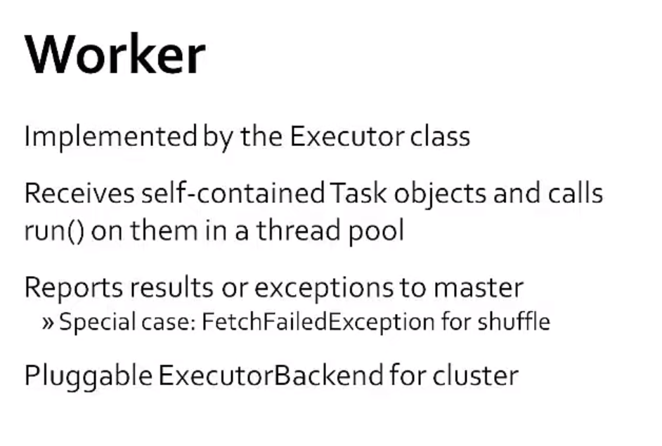

It just recieves these objects and calls run on them and the objects

Other Components:

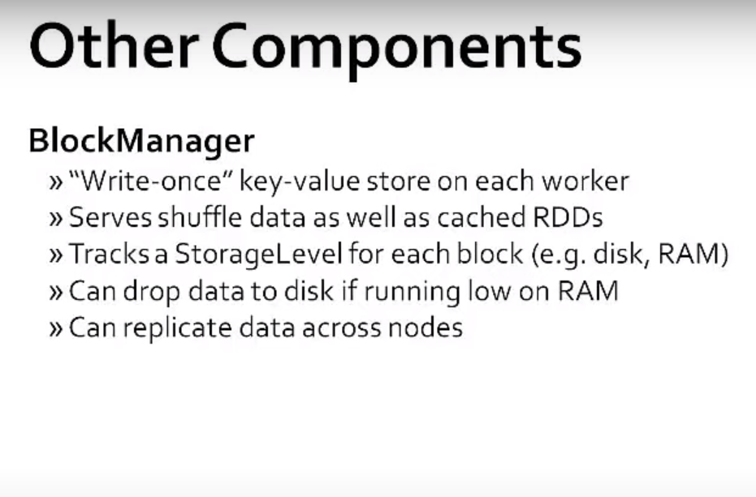

read only key value store

Deals with serving blocks between machines

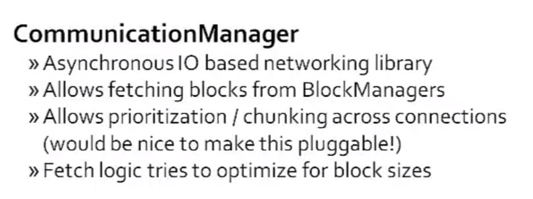

Does this networking and shuffle

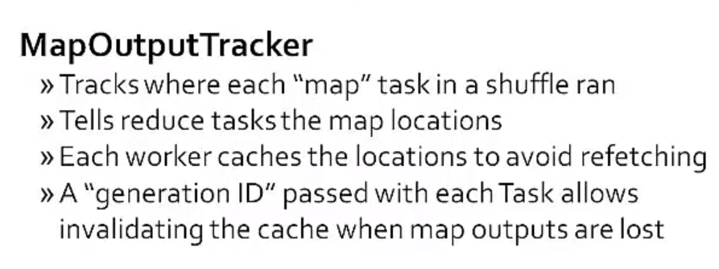

Tells the reduce tasks where to fetch map outputs from. Each worker caches the map locations and this thing deals with
invalidating them as well

How does the task do chaining of operators?

Compute returns an iterator and most of the time it takes in an iterator as well. So FilteredRDD's compute on a split
is: call iterator on the parent and take its iterator and filter it.

How does this get into the task object?
Say we did a filter and then a map or something the task is gonna take the map guy is going to call compute on it and
then the compute is going to recursively call the parent. So the task actually takes all the java objects here, they get
serialized using java serialization. Because filteredRDD has a pointer to its parent we also get its parent and then
when we call compute on like the outer guy it will ask its parent to compute stuff.

So for eg. result task is a task that returns a result back to the master instead of writing map output files. It has 
an rdd it needs to run on, it has a split, it calls rdd.iterator on the split. The rdd objects automatically capture
that chain so it's just some recursive stuff.

iterator is differnt from compute: So compute is like "build it for me, like actally do the computation" and iterator
is "if you have it cached, give me the one from the cache" so clients always call iterator but implementers always 
implement compute.

